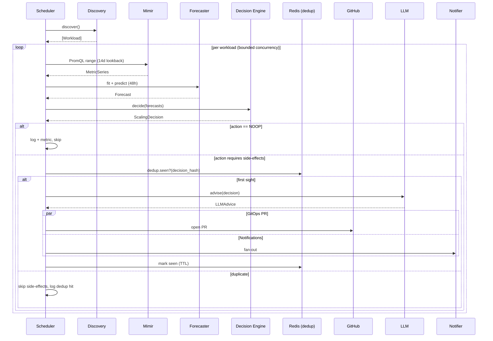

# PCAP Architecture

## Component view

```mermaid
flowchart LR
    subgraph AKS[AKS cluster]
      WL[Deployments / StatefulSets / DaemonSets<br/>JVM · Python · Go · .NET]
      ALLOY[Grafana Alloy]
      WL --> ALLOY
    end

    MIMIR[(Grafana Mimir<br/>long-term TSDB)]
    ALLOY -- remote_write --> MIMIR

    subgraph PCAP[PCAP control plane]
      DISC[Workload Discovery]
      COLL[Metric Collector]
      FCST[Forecasting Engine<br/>Prophet ⇨ statistical fallback]
      DEC[Decision Engine<br/>R-001..R-008]
      GH[GitHub PR<br/>Kustomize + Helm]
      GRF[Grafana Provisioner<br/>dashboards + alerts]
      LLM[LLM Advisor<br/>Anthropic · OpenAI · Azure · Ollama]
      NOT[Notify dispatcher<br/>Teams · Slack · Email]
      AUD[(Audit store<br/>Postgres | JSON log)]
      DISC --> COLL --> FCST --> DEC
      DEC --> GH
      DEC --> GRF
      DEC --> LLM --> NOT
      DEC --> AUD
    end

    MIMIR -- PromQL --> COLL

    subgraph GITOPS[GitOps repo]
      MANIFESTS[Kustomize + Helm]
    end
    GH -- PR --> GITOPS
    ARGO[Argo CD / Flux]
    GITOPS --> ARGO --> AKS
```

## Runtime loop



## Domain contracts (§6)

See [`src/pcap/domain/models.py`](./src/pcap/domain/models.py). **Every module boundary exchanges Pydantic v2 models.** No `dict[str, Any]` crosses package lines.

## Resilience

- **Circuit breakers** on every external client (`pybreaker`). Metric: `pcap_circuit_breaker_state{service}`.
- **Retries** with exponential backoff + jitter (`tenacity`) — idempotent calls only.
- **Bulkheads** — per-service concurrency semaphores.
- **Dedup** via Redis SET NX EX. Keys: `pr:{uid}:{hash}`, `notify:{channel}:{hash}`, `forecast:{uid}:{metric}:{bucket}`.
- **Graceful shutdown** — SIGTERM drains scheduler (≤60s) then exits.

## Self-observability

PCAP emits:
- Prometheus metrics at `/metrics` (listed in `src/pcap/observability/metrics.py`)
- OpenTelemetry spans over each pipeline phase + external call
- Structured JSON logs via `structlog` with correlation IDs

A self-observability Grafana dashboard ships at `deploy/grafana/dashboards/pcap-platform.json`.

## Security posture

- Non-root UID 10001, read-only rootfs, dropped capabilities.
- **Read-only** Kubernetes RBAC — `get/list/watch` only. No write verbs anywhere.
- `NetworkPolicy` egress allow-list.
- All secrets via CSI / ExternalSecrets — never in images or values.yaml.
- Container images SBOM'd (`syft`) and signed (`cosign`).
- PII redaction on every LLM prompt.

## Why these choices — see ADRs

- [ADR-0001 Record architecture decisions](./docs/adr/0001-record-architecture-decisions.md)
- [ADR-0002 Prophet with statistical fallback](./docs/adr/0002-prophet-with-statistical-fallback.md)
- [ADR-0003 Multi-LLM abstraction](./docs/adr/0003-multi-llm-abstraction.md)
- [ADR-0004 No direct cluster writes](./docs/adr/0004-no-direct-cluster-writes.md)
- [ADR-0005 Redis dedup strategy](./docs/adr/0005-redis-dedup-strategy.md)
