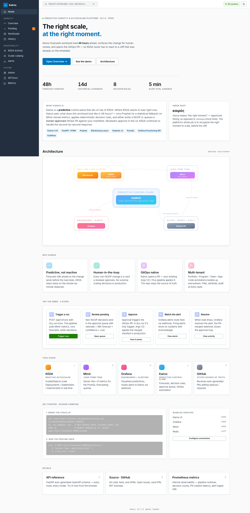
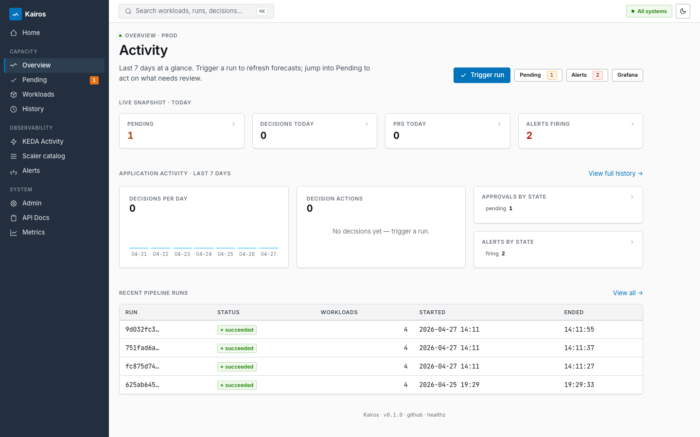
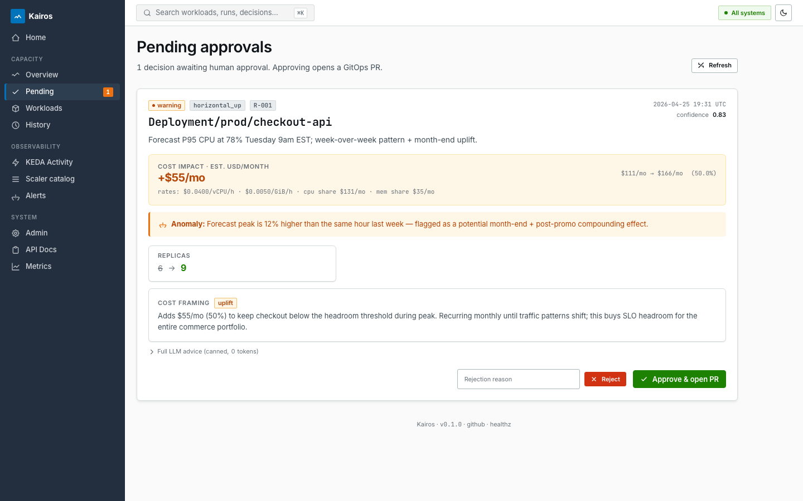
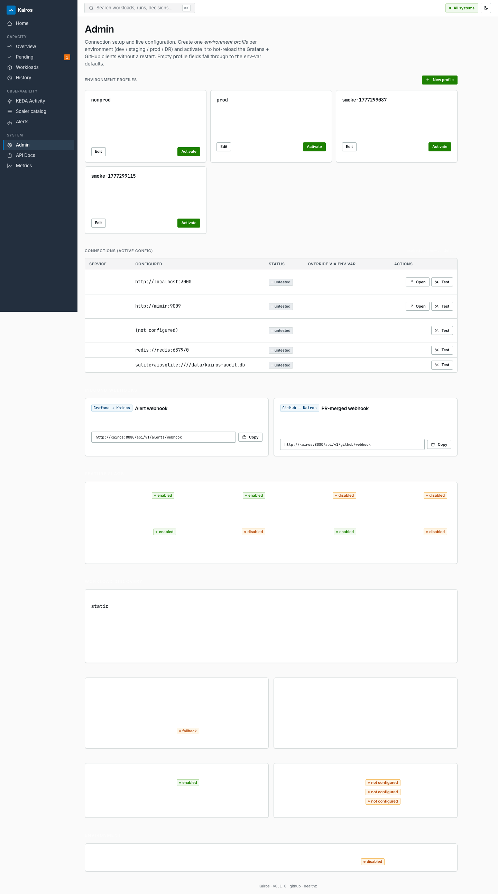
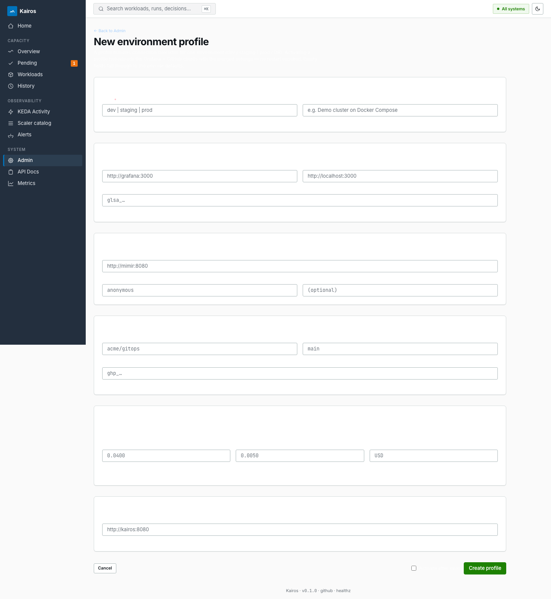
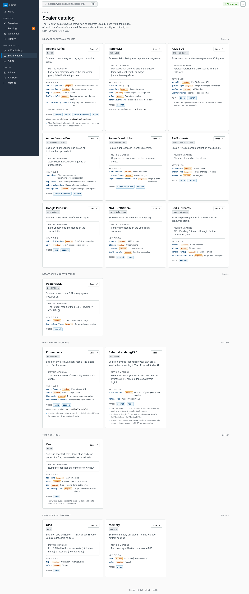
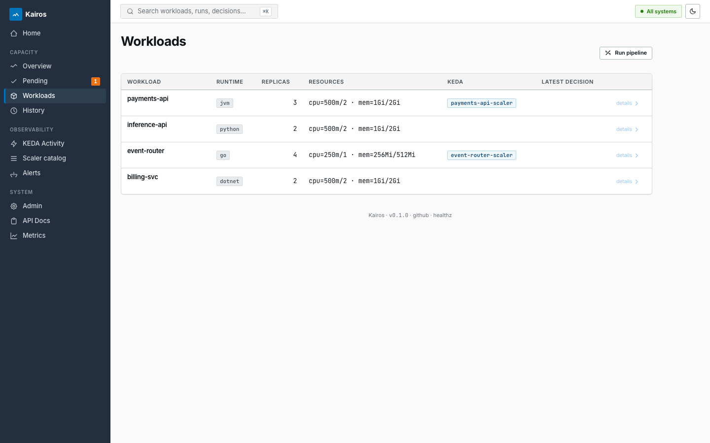
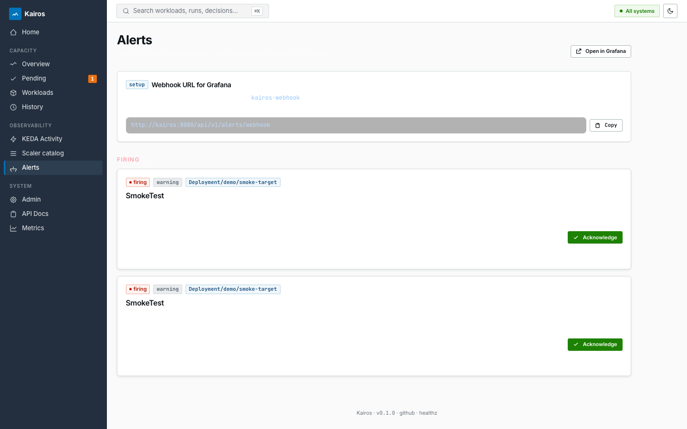
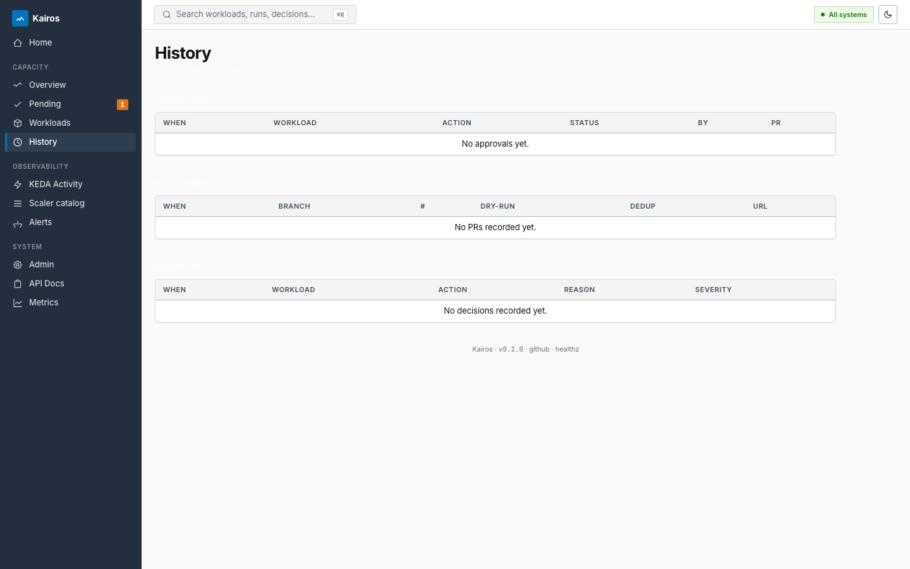

# Kairos — Predictive Capacity & Autoscaling Platform

Forecast 48 hours of CPU / memory demand for your AKS / GKE / EKS workloads, surface every predicted scaling action in a **human-in-the-loop approval UI**, and — once approved — open a GitOps PR. KEDA continues to handle reactive minute-by-minute scaling. Kairos handles the **planning**.

[](./tests)
[](./tests)
[](./pyproject.toml)
[](https://www.python.org/)
[](./LICENSE)

---

## Table of contents

1. [What it does](#what-it-does)
2. [Architecture at a glance](#architecture-at-a-glance)
3. [Quickstart — Docker Compose](#quickstart--docker-compose)
4. [The UI · screenshots](#the-ui--screenshots)
5. [End-to-end walkthrough](#end-to-end-walkthrough)
6. [KEDA validation](#keda-validation)
7. [Grafana alerts + Mimir recording rules](#grafana-alerts--mimir-recording-rules)
8. [Testing](#testing)
9. [Configuration reference](#configuration-reference)
10. [Documentation](#documentation)

---

## What it does

| Capability | Detail |
|---|---|
| **48 h forecast** | Prophet (with statistical fallback) on 14 d of Mimir-stored metrics. Weekly + monthly + holiday seasonality. |
| **Cost engine** | Every decision carries an estimated $/month delta with per-env $/vCPU/h and $/GiB/h rates (Spot in nonprod, on-demand in prod). |
| **LLM rationale** | Each approval card includes a cost-framing paragraph and an anomaly note when the forecast looks unusual vs recent history. |
| **GitOps native** | Approvals open a GitHub PR. Argo CD / Flux applies the merged manifest. Kairos never writes to the cluster. |
| **Multi-tenant** | Portfolio › Program › Team › App-Code annotations (`kairos.io/*`) bubble up to every UI surface. |
| **KEDA toolkit** | `/ui/keda/catalog` browser of 15 scalers; per-workload ScaledObject preview generator; production-best-practices linter (KEDA-001…204). |
| **Multi-environment** | Activate dev / staging / prod / DR profiles from `/ui/admin` to hot-reload Grafana + GitHub clients without a restart. |
| **CloudEvents 1.0** | Outbound webhooks emit CE-wrapped envelopes for Knative EventSources, Azure Event Grid, AWS EventBridge. |
| **Approval emails** | Reviewers get a polished HTML email with cost block, anomaly callout, forecast snapshot, and Approve / Reject deep-link buttons. |

---

## Architecture at a glance

```
                 ┌──────────────┐
                 │   AKS / GKE  │
                 │   workloads  │──┐
                 └──────────────┘  │  scrape
                                   ▼
                         ┌──────────────┐
                         │  Alloy / OTel│
                         └──────┬───────┘
                                │ remote-write
                                ▼
                          ┌──────────┐    ┌──────────────┐
                          │  Mimir   │───►│   Grafana    │
                          │ (14 d)   │    │ dashboards + │
                          └────┬─────┘    │   alerts     │
                               │ PromQL   └──────┬───────┘
                               ▼                 │ webhook
                       ┌─────────────────────────┴──────────┐
                       │              KAIROS                 │
                       │  Prophet · rules R-001..R-008      │
                       │  cost engine · LLM rationale       │
                       │  approval queue · /ui/admin envs   │
                       └────────────────┬───────────────────┘
                                        │ approved
                                        ▼
                                ┌───────────────┐
                                │  GitHub PR    │
                                └───────┬───────┘
                                        │ merge
                                        ▼
                                ┌───────────────┐
                                │  Argo CD /    │
                                │  Flux applies │
                                └───────┬───────┘
                                        │
                                        ▼
                                ┌───────────────┐
                                │  KEDA + HPA   │
                                │  reactive (now)│
                                └───────────────┘
```

Solid lines = primary forecasting flow. KEDA continues to run reactive scaling on the right edge; Kairos plans on the left.

---

## Quickstart — Docker Compose

The bundled stack ships Kairos + Grafana + Mimir + Redis + a seed loader. No cluster needed for the demo.

```bash
git clone https://github.com/gpadidala/kairos.git
cd kairos/deploy/docker-compose
cp .env.example .env                # add your GitHub + Grafana tokens
make up                             # docker compose up -d --build
open http://localhost:8090/ui/home
```

**Bundled services:**

| Service | URL | Purpose |
|---|---|---|
| Kairos UI + API | http://localhost:8090 | This app |
| Grafana | http://localhost:3000 | Dashboards + alert routing |
| Mimir | http://localhost:9009 | Long-term TSDB |
| Redis | localhost:6379 | Dedup + idempotency cache |

Trigger a pipeline run:

```bash
curl -X POST http://localhost:8090/api/v1/runs \
  -H 'Content-Type: application/json' \
  -d '{"dry_run": true}'
```

---

## The UI · screenshots

> Screenshots are auto-captured by the Playwright E2E suite — re-run `pytest tests/e2e/` after a UI change and they regenerate.

### Home — landing & demo
The intro page surfaces the architecture diagram, the 5-step demo walkthrough, and one-click links to Open Overview / Admin.



### Overview / dashboard — 7-day activity
Decisions per day · decisions by action · approvals + alerts state breakdown · counter tiles · recent pipeline runs.



### Pending approvals
Each card shows severity → workload → rationale → **cost impact ($/month delta, color-coded)** → anomaly callout (if any) → proposed-shape diff → cost framing → forecasts → full LLM advice → Approve / Reject buttons.



### Admin — environments + connections
Top: env profile cards with active-state ring, edit / activate / deactivate buttons.
Middle: connection table for Grafana / Mimir / GitHub / Redis / Audit DB with **live Test buttons** (HTMX-driven).
Bottom: webhook URLs + feature flags + workload discovery + forecasting / decision thresholds.



### Admin — env profile form
Per-env override form: Identity · Grafana · Mimir · GitHub · Cost rates · Webhooks. Empty fields fall through to env-var defaults. Activating hot-reloads the Grafana + GitHub clients without a restart.



### KEDA · scaler catalog
15 priority scalers grouped by category. Each card: name, type, summary, metric meaning, top-5 fields with required badges, auth modes, wake-from-zero field, operator notes.



### Workloads
Multi-tenant pills (portfolio · program · team) on every row. Latest decision column on the right.



### Alerts
Webhook URL up top with copy button. Firing alerts as cards with Acknowledge action. Recent (resolved + acknowledged) below as a dense table.



### History
Recent pipeline runs · approvals · PRs.



---

## End-to-end walkthrough

Step 1 — **bring the stack up** (see Quickstart). Confirm the header pill on `/ui/home` reads `All systems`.

Step 2 — **trigger a pipeline run** from `/ui/dashboard` (Trigger run button) or via `POST /api/v1/runs`.

Step 3 — **review pending approvals** at `/ui/pending`. Each card shows the cost delta, anomaly note, and forecast snapshot. Click Approve.

Step 4 — **watch the approval flow**:
- A GitOps PR is opened (or logged in dry-run mode) against the configured GitHub repo.
- The audit row in `/ui/history` flips to `applied`.
- Approval status pill on `/ui/admin` increments.

Step 5 — **observe alerts**:
- Grafana alert rules (provisioned automatically — see [Grafana alerts](#grafana-alerts--mimir-recording-rules)) fire on the `kairos-webhook` contact point.
- Alerts appear at `/ui/alerts` with Acknowledge buttons.
- Reviewer also gets a **rich approval email** with Approve / Reject deep-link buttons (`/ui/approvals/<id>/approve`).

Step 6 — **close the loop**: when the PR merges, Argo CD / Flux applies the manifest, KEDA picks up the new shape, the load drops, Grafana auto-resolves the alert, the GitHub `pull_request.closed + merged=true` webhook hits `/api/v1/github/webhook`, and the matching `ApprovalRow.status` becomes `merged`.

---

## KEDA validation

Kairos generates valid `ScaledObject` / `ScaledJob` / `TriggerAuthentication` / `HTTPScaledObject` YAML for any of the 15 priority scalers — and a production-best-practices linter flags the gotchas.

```bash
# Browse the catalog (UI)
open http://localhost:8090/ui/keda/catalog

# Generate a ScaledObject preview for a workload (API)
curl 'http://localhost:8090/api/v1/keda/scaledobject/preview?workload_uid=Deployment/prod/billing-svc'
```

Add one of these annotations to a workload to auto-detect the right trigger:

| Annotation | Maps to |
|---|---|
| `kairos.io/kafka-topic` (+ `kafka-consumer-group`, `kafka-bootstrap`, `kafka-lag-threshold`) | `type: kafka` |
| `kairos.io/rabbitmq-queue` (+ `rabbitmq-target`) | `type: rabbitmq` |
| `kairos.io/sqs-queue-url` (+ `sqs-target`, `aws-region`) | `type: aws-sqs-queue` |
| `kairos.io/prometheus-query` (+ `prometheus-server`, `prometheus-threshold`) | `type: prometheus` |
| `kairos.io/keda-trigger-type` | explicit override |

The generator also emits **Azure Workload Identity bundles** (ServiceAccount + TriggerAuthentication + the matching `az identity federated-credential create` command as an inline comment) to satisfy the KEDA 2.15+ deprecation of `aad-pod-identity`.

See [docs/keda-reference.md](docs/keda-reference.md) for the full catalog and [docs/keda-integration.md](docs/keda-integration.md) for production wiring.

---

## Grafana alerts + Mimir recording rules

Both ship as provisioning files mounted into the bundled containers.

### Grafana alert rules — `deploy/docker-compose/config/grafana/provisioning/alerting/kairos-alerts.yaml`

| UID | Severity | Fires when |
|---|---|---|
| `kairos-no-recent-runs` | warning | No successful pipeline run in 30 min |
| `kairos-decision-error-rate` | critical | Decision-engine errors > 0.1/s for 5m |
| `keda-scaler-errors` | warning | Per-ScaledObject scaler errors > 0.05/s for 2m |
| `keda-fallback-active` | warning | Any ScaledObject paused / on fallback for 1m |
| `kairos-alert-webhook-failures` | warning | `/api/v1/alerts/webhook` error ratio > 10% over 10m |
| `kairos-firing-alert-pileup` | warning | `kairos_alerts_firing > 25` for 5m |

All route to the auto-provisioned `kairos-webhook` contact point.

### Mimir recording rules — `deploy/docker-compose/config/mimir/recording-rules.yaml`

Pre-aggregated for the dashboards + alerts above:

| Group | Notable rules |
|---|---|
| `kairos.pipeline` | `kairos:pipeline_runs:rate5m`, `kairos:decisions:rate5m`, `kairos:decisions:per_action_24h` |
| `kairos.approvals` | `kairos:approvals:pending`, `kairos:approvals:wait_seconds:p95`, `kairos:prs:opened:rate1h` |
| `kairos.alerts` | `kairos:alerts:received:rate5m`, `kairos:alerts:webhook_error_ratio:5m` |
| `keda.scalers` | `keda:scaler_errors:rate5m`, `keda:scaler_active:by_object`, `keda:hpa_replicas:current/desired` |
| `workload.utilization` | `workload:cpu_cores:p95_5m / peak_24h`, `workload:memory_bytes:p95_5m / peak_24h` (drives forecasts) |

Apply outside Docker Compose with `mimirtool rules load`.

---

## Testing

The repo ships three layers:

```bash
# Unit tests — pure-Python, no external services. ~250 tests, mypy --strict.
uv run python -m pytest -q

# API smoke tests — hit the running compose stack at :8090. ~28 tests.
KAIROS_SMOKE_URL=http://localhost:8090 \
  uv run python -m pytest tests/integration/test_api_smoke.py -v

# Playwright E2E tests + auto-generates docs/screenshots/. ~15 tests.
uv run playwright install chromium      # one-time
KAIROS_E2E_URL=http://localhost:8090 \
  uv run python -m pytest tests/e2e/test_ui_smoke.py -v
```

CI runs unit-only by default; the smoke + E2E suites run on demand against a real compose stack.

---

## Configuration reference

Everything is env-driven via Pydantic Settings (prefix `KAIROS_`, nested with `__`). The most-used:

| Env var | Default | What it controls |
|---|---|---|
| `KAIROS_GRAFANA__URL` | `http://grafana:3000` | Server-side Grafana URL |
| `KAIROS_GRAFANA__EXTERNAL_URL` | — | Browser-facing URL (links) |
| `KAIROS_GRAFANA__API_TOKEN` | — | Provisioning + contact-point auth |
| `KAIROS_MIMIR__URL` | `http://mimir:8080` | Long-term TSDB |
| `KAIROS_GITHUB__REPO` | — | Owner/repo for GitOps PRs |
| `KAIROS_GITHUB__TOKEN` | — | Fine-grained PAT |
| `KAIROS_API__EXTERNAL_URL` | — | Public Kairos URL (used for inbound webhook URLs) |
| `KAIROS_FEATURES__DRY_RUN` | `true` | Skip real PR creation |
| `KAIROS_FEATURES__REQUIRE_UI_APPROVAL` | `true` | Queue every non-NOOP decision |
| `KAIROS_FEATURES__EMIT_CLOUDEVENTS` | `false` | Wrap outbound webhooks as CloudEvents 1.0 |
| `KAIROS_COST__CPU_PER_HOUR` | `0.0400` | Default $/vCPU/hour |
| `KAIROS_COST__MEM_GIB_PER_HOUR` | `0.0050` | Default $/GiB/hour |
| `KAIROS_FORECASTING__HOLIDAY_CALENDARS` | `["us"]` | Prophet holidays (us / in / eu / intl) |

Everything is also overridable per environment from `/ui/admin/envs` — see the screenshots above.

---

## Documentation

| Doc | What's in it |
|---|---|
| [docs/keda-reference.md](docs/keda-reference.md) | Full KEDA reference: 70+ scalers, HTTP add-on, TriggerAuthentication, language consumer impls (Python / Node / Java / .NET / Go / Ruby / PHP) |
| [docs/keda-integration.md](docs/keda-integration.md) | How Kairos integrates with a real KEDA deployment |
| [docs/configuration.md](docs/configuration.md) | Every Pydantic setting, defaults, env vars |
| [docs/installation.md](docs/installation.md) | Detailed install paths (compose / k8s / managed) |
| [docs/runbooks/](docs/runbooks/) | On-call runbooks |
| [docs/adr/](docs/adr/) | Architecture decision records |

---

## License

MIT — see [LICENSE](LICENSE).
